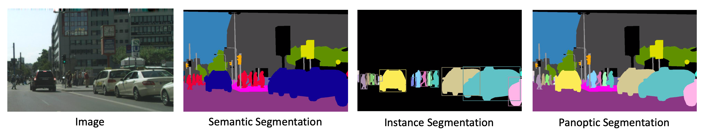
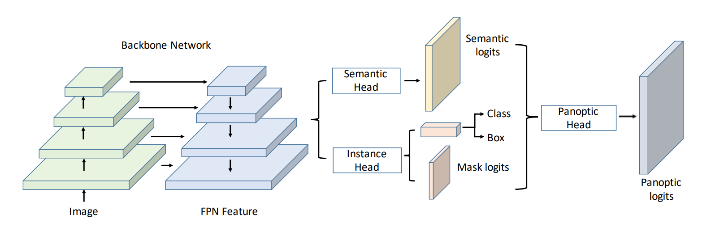
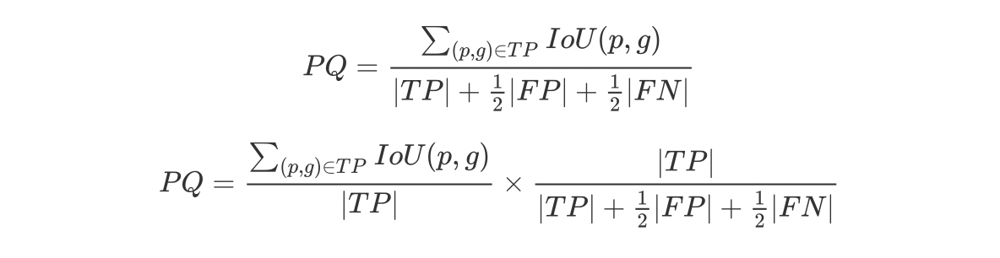
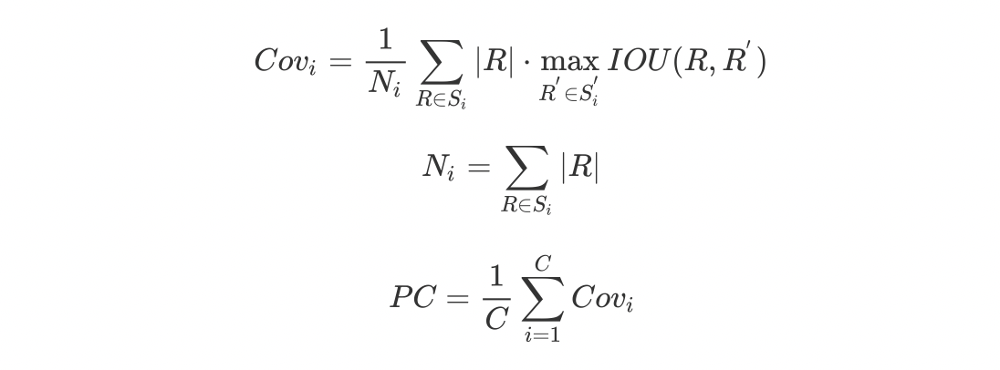

# Awesome-Panoptic-Segmentation 
This repo is a collection of the challenging panoptic segmentation, including papers, codes, and benchmark results, etc.

##  Outline
* [Panoptic Segmentation](#panoptic-segmentation)
* [Datasets](#datasets)
* [Evaluation](#evaluation)
* [Benchmark Results](#benchmark-results)
* [Papers](#papers)
* [Tutorials](#tutorials)
* [Blogs](#blogs)

## Panoptic Segmentation

Summarize in one sentence : Panoptic Segmentation proposes to solve the semantic segmentation(*Stuff*) and instance segmentation(*Thing*) in a unified and general manner.

### Structure Overview

from [UPSNet](https://arxiv.org/pdf/1901.03784.pdf).

## Datasets
Generally, the datasets which contains both semantic and instance annotations can be used to solve the challenging *panoptic* task.

* [COCO-Panoptic](http://cocodataset.org/)
* [Cityscapes](https://www.cityscapes-dataset.com/)
* [Mapillary Vistas](https://blog.mapillary.com/product/2017/05/03/mapillary-vistas-dataset.html)
* [ADE20K](http://groups.csail.mit.edu/vision/datasets/ADE20K/)

## Evaluation
### Metrics
* ``PQ`` are the standard metrics described in [Panoptic Segmentation](https://arxiv.org/pdf/1801.00868.pdf).

* ``PC`` are the standard metrics described in [DeeperLab](https://arxiv.org/pdf/1902.05093).

### Evaluation Code
* [cocodataset/panopticapi](https://github.com/cocodataset/panopticapi)
* [mcordts/cityscapesScripts](https://github.com/mcordts/cityscapesScripts)

### Competition
* [COCO 2019 Panoptic Segmentation Task (ICCV 2019 Workshop, Closed)](http://cocodataset.org/#panoptic-2019)
* [Mapillary 2019 Panoptic Segmentation Task (ICCV 2019 Workshop, Closed)](https://research.mapillary.com/eccv18/#panoptic)
* [Cityscapes Panoptic Semantic Labeling Task (Open)](https://www.cityscapes-dataset.com/benchmarks/#panoptic-scene-labeling-task)
* [COCO 2018 Panoptic Segmentation Task (ECCV 2018 Workshop, Closed)](http://cocodataset.org/index.htm#panoptic-2018)
* [Mapillary Vistas 2018 Panoptic Segmentation Task (ECCV 2018 Workshop, Closed)](https://research.mapillary.com/eccv18/#panoptic)

## Benchmark Results
### COCO Benchmark
| Method | Backbone | PQ | PQ-Thing | PQ-Stuff | SQ | RQ | mIoU | AP-Mask | PC |  e2e | 
| :----------: | :-----------: | :-----------: | :-----------: |:-----------: |:-----------: |:-----------: |:-----------: |:-----------: | :-----------: | :-----------: |
| SOGNet | ResNet-50 | 43.7 | 50.6 | 33.2 | 78.7 | 53.5 | 54.56 | 34.2 | - | :white_check_mark: |
| UPSNet | ResNet-50 | 42.5 | 48.6 | 33.4 | - | - | 54.3 | 34.3 | - | :white_check_mark: |
| OANet | ResNet-101 | 41.3 | 50.4 | 27.7 | - | - | - | - | - | :white_check_mark: |
| OCFusion | ResNet-50 | 41.0 | 49.0 | 29.0 | 77.1 | 50.6 | - | - | - | :white_check_mark: |
| Panoptic FPN | ResNet-101 | 40.9 | 48.3 | 29.7 | - | - | - | - | - | :white_check_mark: |
| AUNet | ResNet-50 | 39.6 | 49.1 | 25.2 | - | - | 45.1 | 34.7 | - | :white_check_mark: |
| DeeperLab | Xception-71 | 34.3 | 37.5 | 29.6 | 77.1 | 43.1 | - | - | 56.8 | :white_check_mark: |

### Cityscapes Benchmark
| Method | Backbone | PQ | PQ-Thing | PQ-Stuff | SQ | RQ | mIoU | AP-Mask | PC |  e2e | 
| :----------: | :-----------: | :-----------: | :-----------: |:-----------: |:-----------: |:-----------: |:-----------: |:-----------: | :-----------: | :-----------: |
| Panoptic(Merge) | - | 61.2 | 66.4 | 54.0 | 80.9 | 74.4 | - | - | - | :negative_squared_cross_mark: |
| SOGNet | ResNet-50  | 60.0 | 56.7 | 62.5 | - | - | - | - | - | :white_check_mark: |
| Seamless | ResNet-50  | 59.8 | 53.4 | 64.5 | - | - | 75.4 | 31.9 | - | :white_check_mark: |
| UPSNet | ResNet-50 | 59.3 | 54.6 | 62.7 | 79.7 | 73.0 | 75.2 | 33.3 | - | :white_check_mark: |
| TASCNet | ResNet-101 | 59.2 | 56 | 61.5 | - | - | 77.8 | 37.6 | - |  :white_check_mark: |
| AUNet | ResNet-101 | 59.0 | 54.8 | 62.1 | - | - | 75.6 | 34.4 | - | :white_check_mark: |
| Panoptic FPN | ResNet-101 | 58.1 | 52.0 | 62.5 | - | - | 75.7 |33.0 | - | :white_check_mark: |
| DeeperLab | Xception-71 | 56.5 | - | - | - | - | - | - | 75.6 |  :white_check_mark: |

### Mapillary Benchmark
| Method | Backbone | PQ | PQ-Thing | PQ-Stuff | SQ | RQ | mIoU | AP-Mask | PC |  e2e | 
| :----------: | :-----------: | :-----------: | :-----------: |:-----------: |:-----------: |:-----------: |:-----------: |:-----------: | :-----------: | :-----------: |
| Panoptic(Merge) | -  | 38.3 | 41.8 | 35.7 | 73.6 | 47.7 | - | - | - | :negative_squared_cross_mark: |
| Seamless | ResNet-50  | 37.2 | 33.2 | 42.5 | - | - | 50.2 | 16.3 | - | :white_check_mark: |
| TASCNet | ResNet-101 | 32.6 | 31.3 | 34.4 | - | - | 35.0 | 18.5 | - | :white_check_mark: |
| DeeperLab | Xception-71 | 31.6 | 25.0 | 40.3 | 75.5 | 40.1 | - | - | 55.3 |  :white_check_mark: |

## Papers 
### AAAI2020
* **SOGNet:** Yibo Yang, Hongyang Li, Xia Li, Qijie Zhao, Jianlong Wu, Zhouchen Lin. "SOGNet: Scene Overlap Graph Network for Panoptic Segmentation." AAAI (2020). [[paper](https://arxiv.org/pdf/1911.07527.pdf)]

### ICCV2019
* **AdaptIS:** Konstantin Sofiiuk, Olga Barinova, Anton Konushin. "AdaptIS: Adaptive Instance Selection Network." ICCV (2019). [[paper](https://arxiv.org/pdf/1909.07829.pdf)]

* Cheng-Yang Fu, Tamara L. Berg, Alexander C. Berg. "IMP: Instance Mask Projection for High Accuracy Semantic Segmentation of Things." ICCV (2019). [[paper](https://arxiv.org/pdf/1906.06597.pdf)]

* Bowen Cheng, Maxwell D. Collins, Yukun Zhu, Ting Liu, Thomas S. Huang, Hartwig Adam, Liang-Chieh Chen. "Panoptic-DeepLab." ICCVW (2019). [[paper](https://arxiv.org/pdf/1910.04751.pdf)]

### CVPR2019
* **Panoptic Segmentation:** Alexander Kirillov, Kaiming He, Ross Girshick, Carsten Rother, Piotr Dollár. "Panoptic Segmentation." CVPR (2019). [[paper](https://arxiv.org/pdf/1801.00868.pdf)]

* **Panoptic FPN:** Alexander Kirillov, Ross Girshick, Kaiming He, Piotr Dollár. "Panoptic Feature Pyramid Networks." CVPR (2019 **oral**). [[paper](https://arxiv.org/pdf/1901.02446.pdf)] [[unofficial code](https://github.com/Angzz/panoptic-fpn-gluon)][[detectron2]](https://github.com/facebookresearch/detectron2)

* **AUNet:** Yanwei Li, Xinze Chen, Zheng Zhu, Lingxi Xie, Guan Huang, Dalong Du, Xingang Wang. "Attention-guided Unified Network for Panoptic Segmentation." CVPR (2019). [[paper](https://arxiv.org/pdf/1812.03904.pdf)]

* **UPSNet:** Yuwen Xiong, Renjie Liao, Hengshuang Zhao, Rui Hu, Min Bai, Ersin Yumer, Raquel Urtasun. "UPSNet: A Unified Panoptic Segmentation Network." CVPR (2019 **oral**). [[paper](https://arxiv.org/pdf/1901.03784.pdf)] [[code](https://github.com/uber-research/UPSNet)]

* **DeeperLab:** Tien-Ju Yang, Maxwell D. Collins, Yukun Zhu, Jyh-Jing Hwang, Ting Liu, Xiao Zhang, Vivienne Sze, George Papandreou, Liang-Chieh Chen. "DeeperLab: Single-Shot Image Parser." CVPR (2019 **oral**). [[paper](https://arxiv.org/pdf/1902.05093)] [[project](http://deeperlab.mit.edu)] [[code](https://github.com/tensorflow/models/tree/master/research/deeplab/evaluation)]

* **OANet:** Huanyu Liu, Chao Peng, Changqian Yu, Jingbo Wang, Xu Liu, Gang Yu, Wei Jiang. "An End-to-End Network for Panoptic Segmentation." CVPR (2019). [[paper](https://arxiv.org/pdf/1903.05027.pdf)]

* Eirikur Agustsson, Jasper R. R. Uijlings, Vittorio Ferrari
. "Interactive Full Image Segmentation by Considering All Regions Jointly." CVPR (2019). [[paper](https://arxiv.org/pdf/1812.01888.pdf)]

* **Seamless:** Lorenzo Porzi, Samuel Rota Bulo, Aleksander Colovic, Peter Kontschieder. "Seamless Scene Segmentation." CVPR (2019) (Extended Version). [[paper](https://arxiv.org/pdf/1905.01220.pdf)][[code](https://github.com/mapillary/seamseg)]

### ECCV2018
* Qizhu Li, Anurag Arnab, Philip H.S. Torr. "Weakly- and Semi-Supervised Panoptic Segmentation." ECCV (2018). [[paper](https://arxiv.org/pdf/1812.01192.pdf)] [[code](https://github.com/qizhuli/Weakly-Supervised-Panoptic-Segmentation)]

### ArXiv
* Mark Weber, Jonathon Luiten, Bastian Leibe. "Single-Shot Panoptic Segmentation." arXiv (2019). [[paper](https://arxiv.org/pdf/1911.00764.pdf)]

* Qiang Chen, Anda Cheng, Xiangyu He, Peisong Wang, Jian Cheng. "SpatialFlow: Bridging All Tasks for Panoptic Segmentation." arXiv (2019). [[paper](https://arxiv.org/pdf/1910.08787.pdf)]

* Sagi Eppel, Alan Aspuru-Guzik. "Generator evaluator-selector net: a modular approach for panoptic segmentation." arXiv (2019). [[paper](https://arxiv.org/pdf/1908.09108.pdf)]

* Jasper R. R. Uijlings, Mykhaylo Andriluka, Vittorio Ferrari. "Panoptic Image Annotation with a Collaborative Assistant." arXiv (2019). [[paper](https://arxiv.org/pdf/1906.06798.pdf)]

* **OCFusion:** Justin Lazarow, Kwonjoon Lee, Zhuowen Tu. "Learning Instance Occlusion for Panoptic Segmentation." arXiv (2019). [[paper](https://arxiv.org/pdf/1906.05896.pdf)]

* **PEN:** Yuan Hu, Yingtian Zou, Jiashi Feng. "Panoptic Edge Detection." arXiv (2019). [[paper](https://arxiv.org/pdf/1906.00590.pdf)]

* **TASCNet:** Jie Li, Allan Raventos, Arjun Bhargava, Takaaki Tagawa, Adrien Gaidon. "Learning to Fuse Things and Stuff." arXiv (2018). [[paper](https://arxiv.org/pdf/1812.01192.pdf)]

* Daan de Geus, Panagiotis Meletis, Gijs Dubbelman. "Panoptic Segmentation with a Joint Semantic and Instance Segmentation Network." arXiv (2018). [[paper](https://arxiv.org/pdf/1809.02110.pdf)]

* Daan de Geus, Panagiotis Meletis, Gijs Dubbelman. "Single Network Panoptic Segmentation for Street Scene Understanding." arXiv (2019). [[paper](https://arxiv.org/pdf/1902.02678.pdf)]

* David Owen, Ping-Lin Chang. "Detecting Reflections by Combining Semantic and Instance Segmentation." arXiv (2019). [[paper](https://arxiv.org/pdf/1904.13273.pdf)]

* Gaku Narita, Takashi Seno, Tomoya Ishikawa, Yohsuke Kaji. "PanopticFusion: Online Volumetric Semantic Mapping at the Level of Stuff and Things." arXiv (2019). [[paper](https://arxiv.org/pdf/1903.01177.pdf)]

## Tutorials
* CVPR 2019 Tutorial on Visual Recognition and Beyond. [[slides](https://www.dropbox.com/s/t6tg87t78pdq6v3/cvpr19_tutorial_alexander_kirillov.pdf?dl=0)] [[homepage](http://feichtenhofer.github.io/cvpr2019-recognition-tutorial/?nsukey=sJf%2BXalFUZ1SdTHfNF9ApK0yHb3RiOUTjCdoDI0FTj2gtGZgjyITEf3MIwlgv1CWJywF4qeEOFiUd14dVkeQjn61Yh4mOoqDVb%2Ff4BDiWtBZCNZzozDG5ryVLAM4y8kHxz2NXKdlyjgF2BwgPUMBLs4RrvMNRpgQl8PZ9KPBmhwEXq71r6E4dCCvEFCdio1Lj3aQc%2FoyG%2FdLIN3tBmSjPQ%3D%3D)]
* COCO 2017 Workshop. [[slides](http://presentations.cocodataset.org/COCO17-Stuff-FAIR.pdf)]

## Blogs
* Megvii(Face++) Detection Team. [[zhihu]](https://zhuanlan.zhihu.com/p/59141570)

